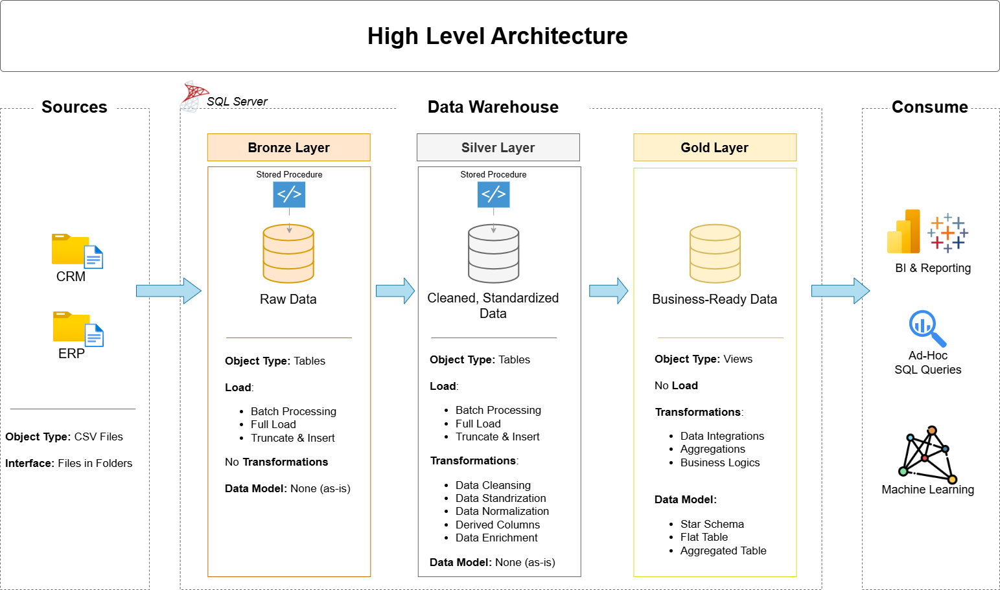
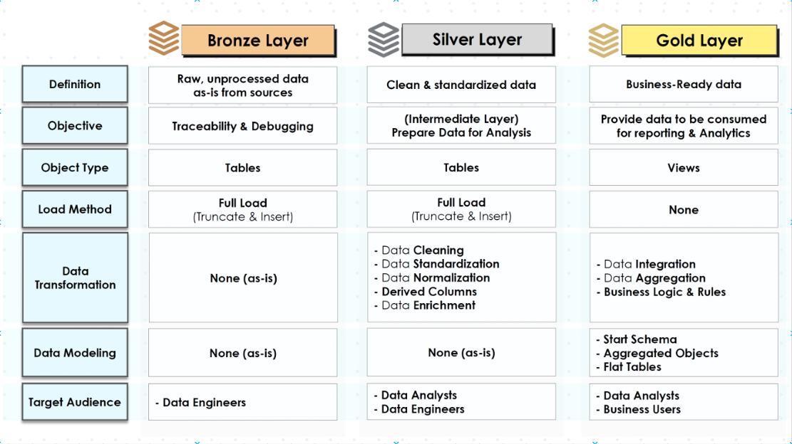
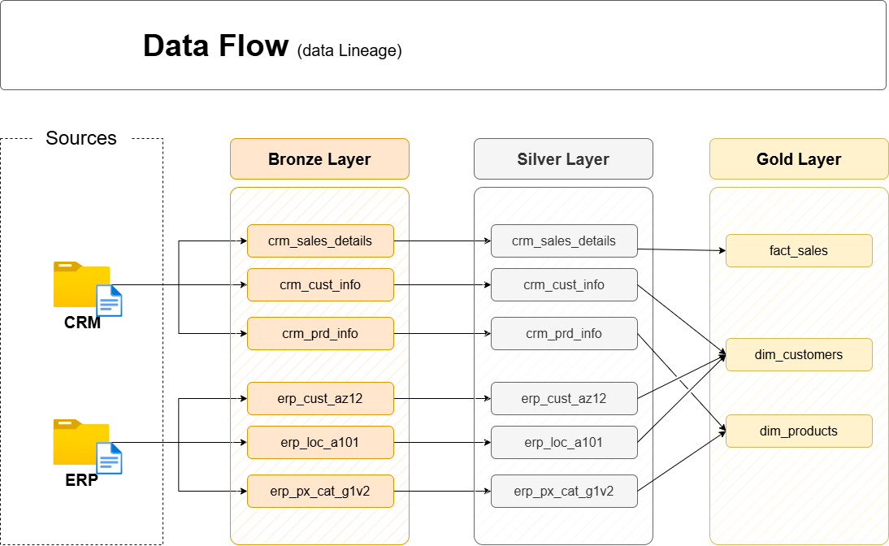
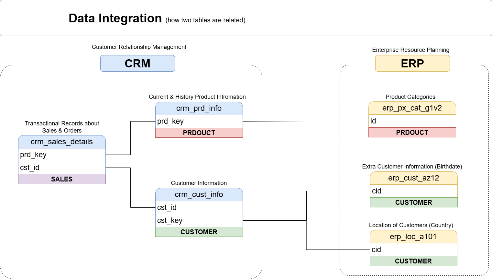
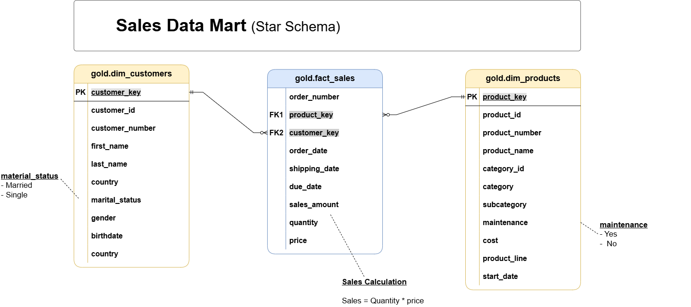
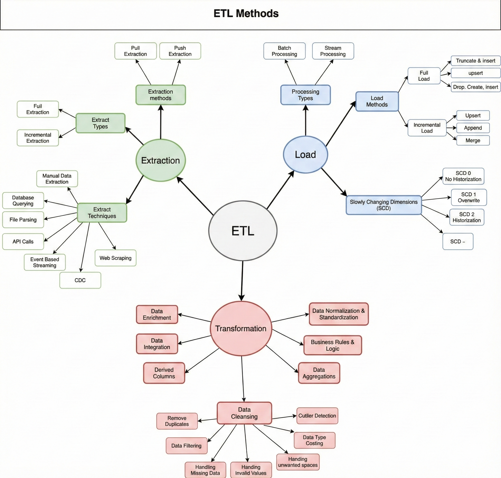

# SQL Data Warehouse — End-to-End Project (Medallion Architecture)

Build a complete **Data Warehouse** using the **Medallion Architecture** (**Bronze → Silver → Gold**) in **SQL-SERVER** to transform raw CSV, extracts into **analytics‑ready** datasets.

---

# Data Architecture


---

# Medallion Architecture


---

# Data Flow


---

# Data Integration


---

# Data Model


---

# ETL


---

## 🏗️ What This Project Delivers

- A fully working **end‑to‑end warehouse pipeline** in **T‑SQL**
- Clear separation of responsibilities using **Bronze**, **Silver**, and **Gold** layers
- A **business-friendly** reporting model (Star Schema style):
  - **Dimensions:** Customers, Products  
  - **Fact:** Sales

---

## 🧱 Architecture (Bronze → Silver → Gold)

### 🥉 Bronze Layer — *Raw Ingestion*
- Loads raw data from **CSV files** into the `bronze` schema.
- Keeps structures close to the source for traceability.

### 🥈 Silver Layer — *Cleansing & Standardization*
- Applies **data cleaning**, **standardization**, and **conformance**.
- Adds `dwh_create_date` for lineage/auditing.

### 🥇 Gold Layer — *Business / Analytics*
- Creates **analytics-ready views**:
  - `gold.dim_customers`
  - `gold.dim_products`
  - `gold.fact_sales`

---

## ⚙️ Tech Stack

- **Microsoft SQL Server**
- **T‑SQL**
- **BULK INSERT** for file-based ingestion

---

## 🚀 How to Run (Recommended Order)

> ⚠️ **Warning:** `scripts/init_database.sql` will **DROP** and recreate the `DataWarehouse` database.

1. **Create database + schemas**
   - Run: `scripts/init_database.sql`

2. **Create Bronze tables**
   - Run: `scripts/bronze/ddl_bronze.sql`

3. **Create & execute Bronze load procedure**
   - Run: `scripts/bronze/proc_load_bronze.sql`
   - Execute: `EXEC bronze.load_bronze;`

4. **Create Silver tables**
   - Run: `scripts/silver/ddl_silver.sql`

5. **Create & execute Silver load procedure**
   - Run: `scripts/silver/proc_load_silver.sql`
   - Execute: `EXEC silver.load_silver;`

6. **Create Gold views**
   - Run: `scripts/gold/ddl_gold.sql`

7. **Run data quality checks**
   - Run: `tests/quality_checks_silver.sql`
   - Run: `tests/quality_checks_gold.sql`

---

## 📦 Dataset Setup (Important)

The Bronze load procedure uses **hard-coded local paths** for CSV ingestion (via `BULK INSERT`), e.g.:

- `C:\sql\dwh_project\datasets\source_crm\...`
- `C:\sql\dwh_project\datasets\source_erp\...`

Make sure your dataset folder matches these paths **or update the paths** inside:

- `scripts/bronze/proc_load_bronze.sql`

---

## ✅ Data Quality

This repo includes SQL checks to validate:
- **Primary key uniqueness**
- **Standardized values** (gender, marital status, country, etc.)
- **Valid date ranges**
- **Sales consistency** (sales = quantity × price)
- **Gold model integrity** (fact ↔ dimensions connectivity)

---

## 📚 Documentation

- Gold layer reference: `docs/data_catalog.md`
- Architecture & flow diagrams: `docs/`

---

## 🗂️ Repository Structure

```
.
├── README.md
├── datasets
│   ├── source_crm
│   └── source_erp
├── docs
│   ├── data_catalog.md
│   └── (architecture / flow / model diagrams)
├── scripts
│   ├── init_database.sql
│   ├── bronze
│   │   ├── ddl_bronze.sql
│   │   └── proc_load_bronze.sql
│   ├── silver
│   │   ├── ddl_silver.sql
│   │   └── proc_load_silver.sql
│   └── gold
│       └── ddl_gold.sql
└── tests
    ├── quality_checks_silver.sql
    └── quality_checks_gold.sql
```
---

### ⭐ If you found this helpful, consider giving the repo a **star**!
